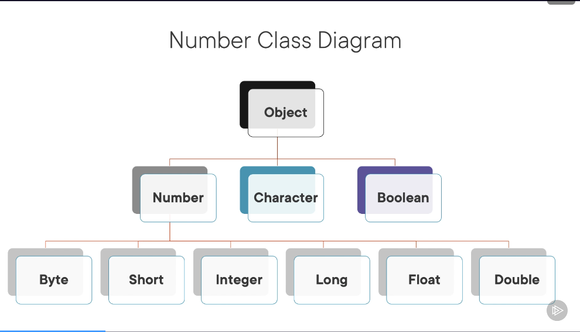

# 1.3 Using Primitive Wrappers

- Each primitive type has a corresponding wrapper type - this usually starts with a capital letter and is part of the `java.lang` class
- e.g. `boolean` -> `java.lang.Boolean`, `int` -> `java.lang.Integer` etc.
- `Number`, `Character`, and `Boolean` are all subtypes of the Object Class. All numeric wrappers (Integer, Double, Long etc.) are subtypes of the Number class.
    

## 1.3.1 Conversion Methods
- There are three types of conversion methods

- The first will convert an instance of the java.lang.Number type to any one of the numeric primitive types.
```java
Integer intWrapper = new Integer(7);

byte   bytVal = intWrapper.byteValue( );  // 7
short  shtVal = intWrapper.shortValue( ); // 7
int    intVal = intWrapper.intValue( );   // 7
long   lngVal = intWrapper.longValue( );  // 7L
float  fltVal = intWrapper.floatValue( ); // 7.0f
double dblVal = intWrapper.doubleValue( );// 7.0
``` 
- However, this breaks down when the range is outside the range of the primitive, similar to how casting works. It will succeed, but will have unpredictable results:
- In addition, doubles will have their decimal component stripped if cast to a whole number datatype
```java
intWrapper = new Integer(200_000);
shtVal = intWrapper.shortValue(); // 3392

Double dblWrapper = new Double(3.14);
bytVal = dblWrapper.byteValue(); // 3
```

- Every wrapper type also contains parsing methods, so a string can be parsed into a number as long as the string contains a valid number. For example:
```java
    String strNum = "1234";
    intVal = Integer.parseInt(strNum); // 1234
    fltVal = Float.parseFloat(strNum); // 1234.0f
```
- Invalid strings will through a NumberFormatException - such as decimal strings to ints, nulls, or non-numeric strings:
```java
        try {
            shtVal = Short.parseShort("Hello World");
        }catch(java.lang.NumberFormatException nfe){
            // the exception is always thrown
        }

        try {
            intVal = Integer.parseInt("3.14");
        }catch(java.lang.NumberFormatException nfe){
            // the exception is always thrown
        }

        try {
            intVal = Integer.parseInt(null);
        }catch(java.lang.NumberFormatException nfe){
            // the exception is always thrown
        }
```
- Booleans have parse methods that only accept the strings "true" or "false" (case insensitive). If a string or object cannot be parsed it defaults to false.
```java
    boolean booVal = Boolean.parseBoolean("TRUE"); // true
    booVal = Boolean.parseBoolean("false"); // false

    booVal = Boolean.parseBoolean("troop"); // false
    booVal = Boolean.parseBoolean(null);   // false
```
- The Character wrapper doesn't have a parse method
- All primitive wrapper types support `valueOf()` methods. These methods will return the value in a new primitive wrapper, e.g.:
```java
    Long longWrap = Long.valueOf(23234);        // new Long(23234)
    Integer intWrap = Integer.valueOf("23234"); // new Long(23234)
```

## 1.3.2 Autoboxing and Unboxing
- Autoboxing and Unboxing is meant to make the conversion methods obsolete, or automatic in the background. These features were introduced in Java 5.
- `Autoboxing` - When a primitive is automatically converted into its wrapper class
- `Unboxing` - When a wrapper class is automatically converted to a primitive
```java
    Integer integer = 234;
    int intPrimitive = integer;
```
- Wrapper classes are immutable, so the value cannot be changed
- The boxing methods use value copy to transfer values - there are no copies or references kept
- Autoboxing and Unboxing are supported by ALL the primitive wrapper classes
- Widening is also supported in unboxing:
```java
    sValue = byteWrapper;
    iValue = shortWrapper;
    lValue = intWrapper;
    fValue = longWrapper;
    dValue = floatWrapper;
```
- What doesn't work though:
```java
    /* Casting with unboxing doesn't work */
    byValue = (byte) shortWrapper;
    fValue = (float) doubleWrapper;

    /* Casting wrapper to wrapper does not work */
    shortWrapper = (short)intWrapper;
    floatWrapper = (float)doubleWrapper;

    shortWrapper = (Short)intWrapper;
    floatWrapper = (Float)doubleWrapper;
```
- Method parameters support autoboxing and unboxing - so a method will accept an integer if it expects a wrapper integer:
```java
    /* Methods parameters support autoboxing */
    iValue = 9;
    wrapperMethod(iValue);

    /* Method paramters also support unboxing */
    intWrapper = new Integer(3);
    valueMethod(intWrapper);
```
- Finally, wrapper classes accept null values even if their primitive doesn't. This means that in a list, for example, `null` is a valid entry:
```java
    List<Integer> list = Arrays.asList(1, 2);
    list.add(null);
```

## 1.3.3 Custom Wrappers
- You can create your own wrapper classes in Java. 
- All primitive wrapper classes are final - meaning that it cannot be altered by subclasses 
- The purpose of a primitive wrapper class is to encapsulate a primitive value
- Wrappers are immutable - a final variable has to be initialised either in place or via a constructor.
    - Hence if the value is final, there needs to be a constructor
    - Validation can be put in place here.
- Useful to include getter methods in order to get the value BUT NOT setters - do not want to change the value of the wrapper
- Any helper methods for conversions etc. would be desirable for interoperability
    - All wrapper classes have an equals, hashcode, and toString method.
    - equals() and hashcode() allows the wrappers to be used effectively in collections
    - toString() returns a literal representation of the value held by the wrapper
- For example, here is the custom Volume wrapper from the course:
```java
public final class Volume {

    public final double liters;
    private final static double MIN_LITERS = 0;
    private final static double MAX_LITERS = Double.MAX_VALUE;

    public Volume(double inLiters){
        if( inLiters >= MIN_LITERS ) throw new java.lang.NumberFormatException();

        liters = inLiters;
    }
    public double getVolume(){
        return liters;
    }
    public double inMilliliters(){
        return liters * 1000;
    }
    public double inQuarts(){
        return liters * 1.05669;
    }
    public boolean equals(Object obj){
        if( obj.getClass() != this.getClass() ) return false;
        Volume other = (Volume)obj;
        if(other.getVolume() == this.liters) return true;
        return false;
    }
    public String toString(){
        return Double.toString(liters) + "ltrs";
    }

    public int hashCode(){
        return this.toString().hashCode();
    }

}
```

In summary, the idioms of a wrapper class are:

- Class is final
- Instances are immutable
- There is a range of values
- Read, not write the value
- Includes equals, hashcode, and toString methods
- Helper methods
- Serializable and Comparable
