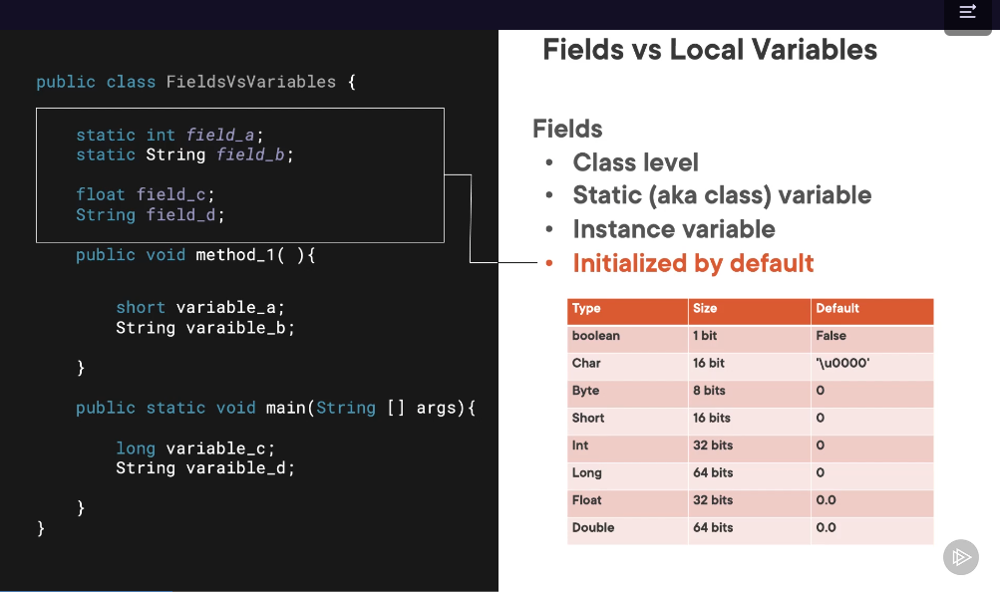
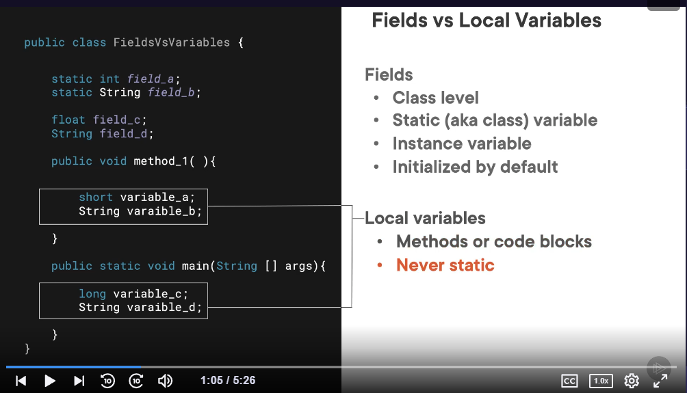
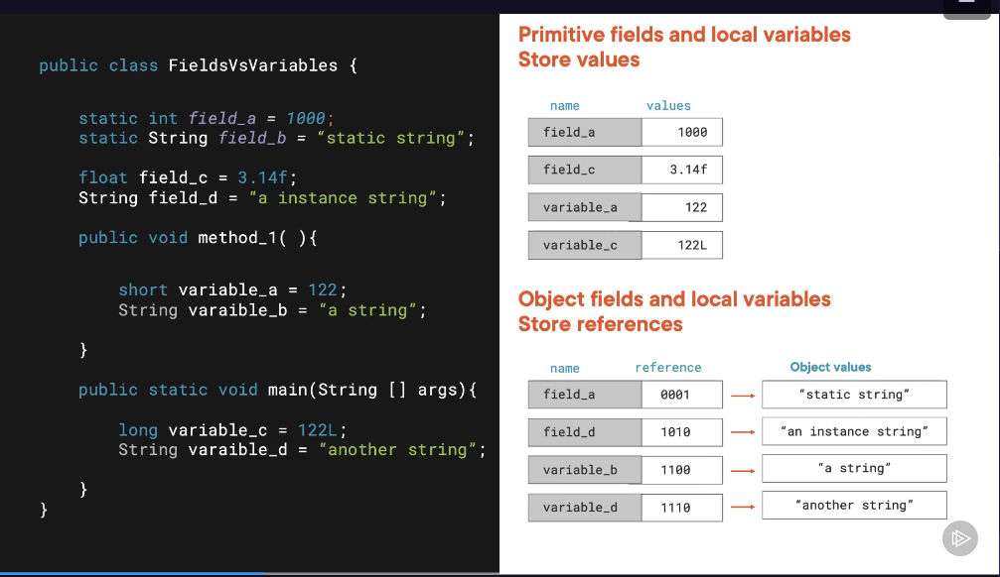
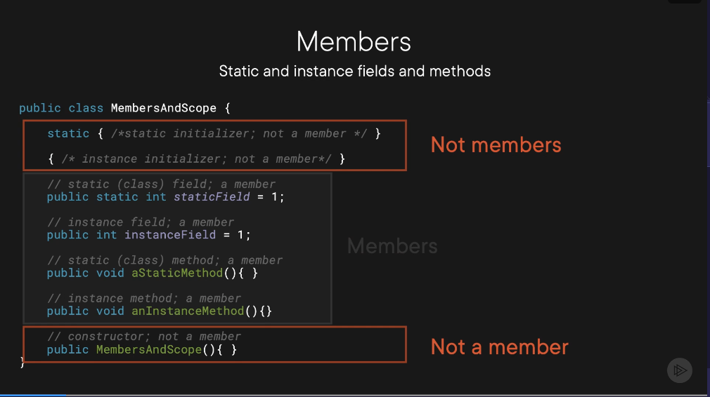
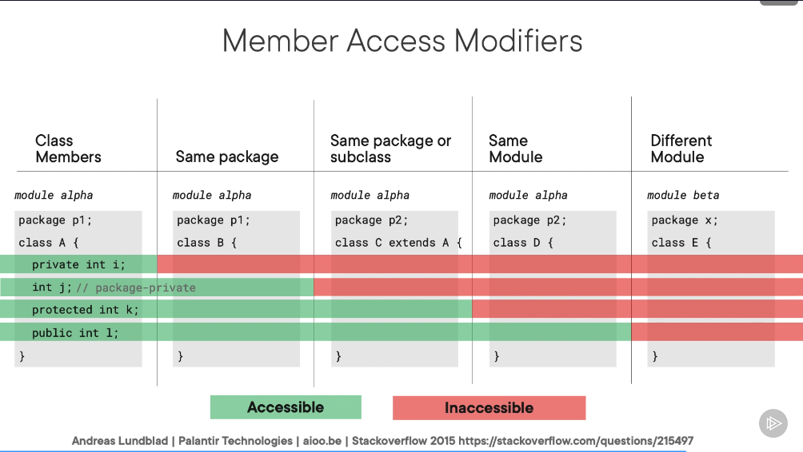

# 1.4 Understand Variable Rules and Scope

## 1.4.1 Fields, Local Variables, Primitives, and Reference Types
- `Fields` are declared at the class level and can be either static (i.e. class) variable or an instance variable
- Class and instance variables have a default value, so variables declared as such will be automatically intialised with this default value

- Local variables are declared within methods or code blocks
- Local variables are never static and must be initialised

- Primitive fields and local variables store values, whereas Object fields and local variables store references (or pointers) to values. Although this example uses only strings, the rule applies to all object types.
- Note that an object reference can be set to `null` to clear the value - this cannot be done with a primitive data type

- Note that a common gotcha is partial initialisation - where a variable is only initialised under certain conditions. This will still result in a compilation error, and is bad practice unless used properly either way. If there is an if statement, all branches must intialised the variable.

## 1.4.2 Members and Member Scope
- A member is an aspect of a class that can be inherited - a fields or a method of the class
- Constructors, static intialisers, and instance initialisers are not members as they cannot be inherited by subclasses - see the code below.

- Members and constructors can be assigned access modifiers to denote availability to other packages and classes:
    - If no modifier is declared, it is given the default of `package-private` - can only be accessed inside the current package
    - `protected` - Only accessible inside same package or subclasses of the package
    - `private` - Only accesible in the same class it is declared
    - `public` - Available across the whole module, but not different modules
    

- Remember that you can only access instance variables from instance methods - you cannot access static fields from non-static methods.